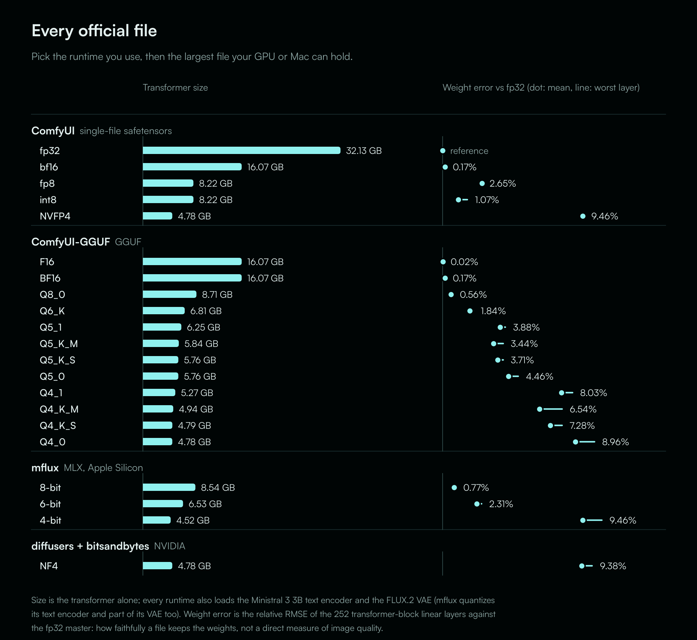
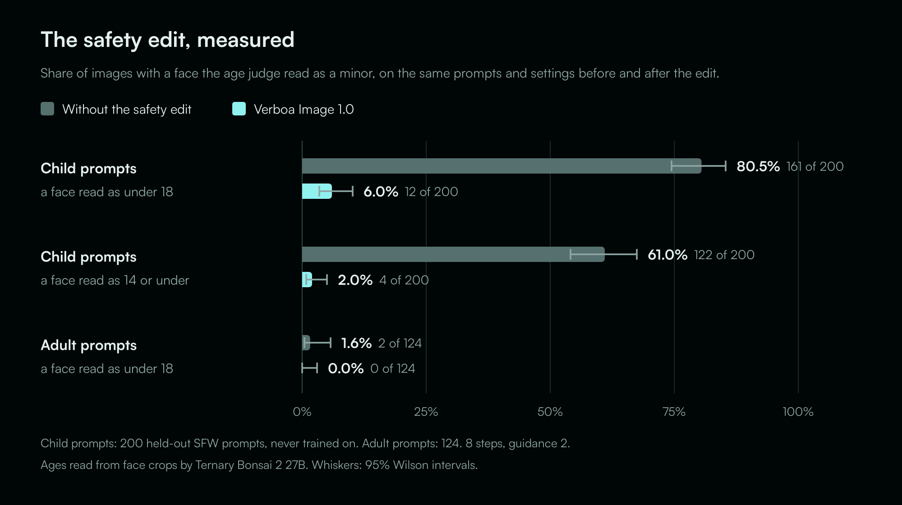

# Verboa Image 1.0

<p align="center">
  <a href="https://huggingface.co/verboa/Verboa-Image-1.0">Hugging Face</a> &nbsp;|&nbsp;
  <a href="https://civitai.com/user/verboa">CivitAI</a> &nbsp;|&nbsp;
  <a href="https://verboa.io">verboa.io</a> &nbsp;|&nbsp;
  <a href="https://x.com/verboa_ai">X</a>
</p>

Verboa Image 1.0 is an 8B photorealistic text-to-image model for adults. It is a full fine-tune of
[ERNIE-Image](https://huggingface.co/baidu/ERNIE-Image), Baidu's single-stream diffusion transformer, on about 300,000
captioned images, with [ERNIE-Image-Turbo](https://huggingface.co/baidu/ERNIE-Image-Turbo)'s few-step ability
transplanted onto it. **It finishes an image in 8 steps.**

This repository holds the small files: the ComfyUI workflows, the Prompt Writer's ComfyUI node, an inference script,
the license and how to report a problem. The weights, the full model card, the sample images and the safety report are on
[Hugging Face](https://huggingface.co/verboa/Verboa-Image-1.0).

> **18+ only.** The model generates explicit adult content on request. This page contains none; the model card on
> Hugging Face does. The weights are gated there, and the license's use restrictions apply to every copy.

## News

- **September 2026:** Verboa Image 1.0 released, in every format from fp32 to 4-bit.
- **September 2026:** [Verboa Prompt Writer](https://huggingface.co/verboa/Verboa-Prompt-Writer), a small model that writes prompts for Verboa Image in ComfyUI.

## Models

| repo | what is in it | runs in |
|---|---|---|
| [verboa/Verboa-Image-1.0](https://huggingface.co/verboa/Verboa-Image-1.0) | single files in fp32, bf16, fp8, int8 and NVFP4, and a diffusers folder | ComfyUI, diffusers |
| [verboa/Verboa-Image-1.0-GGUF](https://huggingface.co/verboa/Verboa-Image-1.0-GGUF) | 12 GGUF files, F16 down to Q4_0 | ComfyUI with [ComfyUI-GGUF](https://github.com/city96/ComfyUI-GGUF) |
| [verboa/Verboa-Image-1.0-mflux-8bit](https://huggingface.co/verboa/Verboa-Image-1.0-mflux-8bit), [-6bit](https://huggingface.co/verboa/Verboa-Image-1.0-mflux-6bit), [-4bit](https://huggingface.co/verboa/Verboa-Image-1.0-mflux-4bit) | MLX weights | [mflux](https://github.com/filipstrand/mflux) on Apple Silicon |
| [verboa/Verboa-Image-1.0-nf4](https://huggingface.co/verboa/Verboa-Image-1.0-nf4) | NF4 transformer with the rest of the pipeline | diffusers with bitsandbytes |
| [verboa/Verboa-Prompt-Writer](https://huggingface.co/verboa/Verboa-Prompt-Writer) | the Prompt Writer: a 2B language model that writes prompts, in fp8 and bf16 | ComfyUI, with the node in [`ComfyUI-Verboa/`](ComfyUI-Verboa/__init__.py) |

Every file is the same model at a different precision:

<p align="center">
  
</p>

## Quick start

The repos are gated: open the model page while logged in to Hugging Face and accept the terms, then run
`hf auth login` on the machine that downloads.

### ComfyUI

ERNIE-Image is supported natively, so the image model needs no custom nodes. Put the files in place and load
[`workflows/verboa-image-1.0.json`](workflows/verboa-image-1.0.json) (NVIDIA) or
[`workflows/verboa-image-1.0-mac.json`](workflows/verboa-image-1.0-mac.json) (Apple Silicon):

| file | from | folder |
|---|---|---|
| `verboa-image-1.0-fp8.safetensors` (NVIDIA) or `-bf16` (Mac) | [verboa/Verboa-Image-1.0](https://huggingface.co/verboa/Verboa-Image-1.0) | `models/diffusion_models/` |
| `ministral-3-3b.safetensors` | [Comfy-Org/ERNIE-Image](https://huggingface.co/Comfy-Org/ERNIE-Image) | `models/text_encoders/` |
| `flux2-vae.safetensors` | [Comfy-Org/ERNIE-Image](https://huggingface.co/Comfy-Org/ERNIE-Image) | `models/vae/` |

If you build your own graph, two settings matter: a **ModelSamplingSD3 node at shift 4.0** with the `simple`
scheduler (ComfyUI's default shift for ERNIE is 3.0), and an **empty CLIPTextEncode as the negative**, not
ConditioningZeroOut. With both, ComfyUI and diffusers render the same picture.

For the GGUF files, install ComfyUI-GGUF, put the file in `models/diffusion_models/`, and load
[`workflows/verboa-image-1.0-gguf.json`](workflows/verboa-image-1.0-gguf.json) (it uses the **Unet Loader (GGUF)**
node).

### The Prompt Writer (ComfyUI)

[Verboa Prompt Writer](https://huggingface.co/verboa/Verboa-Prompt-Writer) writes the prompt for you. Its node, in [`ComfyUI-Verboa/`](ComfyUI-Verboa/__init__.py),
has three modes: **Let Us Choose** (nine fields such as people, age, place and length, each one optional),
**Surprise Me** (it picks for you) and **Write My Own** (your own prompt, through the same workflow).

1. Copy the `ComfyUI-Verboa` folder into `ComfyUI/custom_nodes/` and restart ComfyUI.
2. Put `verboa-prompt-writer-fp8.safetensors` (NVIDIA) or `verboa-prompt-writer-bf16.safetensors` (Mac), from
   [Hugging Face](https://huggingface.co/verboa/Verboa-Prompt-Writer), in `models/text_encoders/`.
3. Load [`workflows/verboa-image-1.0-writer.json`](workflows/verboa-image-1.0-writer.json) (NVIDIA) or
   [`workflows/verboa-image-1.0-mac-writer.json`](workflows/verboa-image-1.0-mac-writer.json) (Mac).

Each run writes a new prompt and renders it. It needs ComfyUI 0.19.0 or newer.

### diffusers

```bash
pip install -r requirements.txt
python inference.py --prompt "a candid phone photo of a woman in her twenties laughing at a cafe table, natural light"
```

[`inference.py`](inference.py) is the model card's snippet as a script:

```python
import torch
from diffusers import ErnieImagePipeline

pipe = ErnieImagePipeline.from_pretrained(
    "verboa/Verboa-Image-1.0",
    torch_dtype=torch.bfloat16,
    pe=None, pe_tokenizer=None,          # no prompt enhancer
).to("cuda")

image = pipe(
    prompt="a candid phone photo of a woman in her twenties laughing at a cafe table, natural light",
    negative_prompt="",
    height=1264, width=848,
    num_inference_steps=8,
    guidance_scale=2.0,
    use_pe=False,                        # required
    generator=torch.Generator("cuda").manual_seed(0),
).images[0]
image.save("verboa.png")
```

`pipe.enable_model_cpu_offload()` (`--offload` in the script) fits the bf16 model on a 24 GB card. On 24 GB the fp8
file in ComfyUI is faster, because it fits without offloading.

### mflux (Apple Silicon)

```bash
mflux-generate-ernie-image --model verboa/Verboa-Image-1.0-mflux-8bit --steps 8 --guidance 2 --height 1264 --width 848 \
  --prompt "a candid phone photo of a woman in her twenties laughing at a cafe table, natural light"
```

Set steps and guidance yourself: mflux's ERNIE-Image default is guidance 4.0.

## Settings

| | |
|---|---|
| Steps and guidance | **8 steps, guidance 2.0**. At guidance 1.0 earlier builds often failed to draw a face |
| Negative prompt | empty |
| Prompt enhancer | not used: run with `use_pe=False` (diffusers). The model was trained on raw prompts |
| Size | about 1 MP: 1024×1024, 848×1264, 1264×848, 768×1376, 1376×768, 896×1200, 1200×896 |

## Hardware

| setup | file | measured |
|---|---|---|
| NVIDIA 24 GB | fp8 | about 27 s per 1024×1024 image at 8 steps (laptop RTX 5090, diffusers) |
| NVIDIA 16 GB | fp8 | runs; fp8 is native on Ada, Hopper and Blackwell, older cards dequantize |
| Apple Silicon, 32 GB+ | bf16 or int8 | 2 to 5 minutes per image on a 32 GB M5 in ComfyUI |

For RTX 50 cards with little memory, NVFP4. For older NVIDIA cards, int8 or GGUF.

## Prompting

Write what you want the way you would say it. Every training caption was written as the prompt a particular person
would type: two words to a long paragraph, slang to clinical, casual to formal. A sentence of 15 to 40 words is the
sweet spot. State ages as adults write them ("in her twenties", "a man in his thirties"), and negations work inline
("no tattoos"). Tag lists from other model families ("masterpiece, best quality") were not trained. Or let the
[Prompt Writer](https://huggingface.co/verboa/Verboa-Prompt-Writer) write it.

```
Tag: woman, 30s, reading on a window seat, rainy afternoon, soft window light, 35mm film grain
Casual: woman curled up reading by the window on a rainy day, cozy, gray light
Photography: Candid 35mm photograph of a woman in her thirties reading on a window seat, rain on the glass, soft gray afternoon light, shallow depth of field, natural skin texture.
Storyteller: A rainy afternoon in a small apartment. A woman in her thirties has lost herself in a paperback on the window seat, knees up, a mug of tea going cold beside her while the rain streaks the glass.
```

## Safety

- **Training data:** only commercial studio photography, age-screened, and all 299,996 training images passed a
  CSAM hash scan (Cloudflare's CSAM Scanning Tool) with zero matches.
- **Weights:** before release the model was trained to turn a request for a child into an adult. On 200 held-out child
  prompts, images with a face read as under 18 fell from 80.5% to 6.0%, and 14 or under from 61.0% to 2.0%. It makes a
  child far less likely, not impossible; the license forbids trying.

<p align="center">
  
</p>

The full record is in the [safety report](https://huggingface.co/verboa/Verboa-Image-1.0/blob/main/SAFETY.md). To
report misuse or a safety problem, see [SECURITY.md](SECURITY.md): email **abuse@verboa.io**, not a public issue.

## License

The weights are released under the **CreativeML Open RAIL++-M License with one additional use restriction**
([`LICENSE.md`](LICENSE.md)): no sexually explicit, nude or intimate imagery of a real, identifiable person without
that person's explicit prior consent. The use restrictions travel with every copy and derivative. Upstream components
and what was modified: [`NOTICE.md`](NOTICE.md). The workflows and scripts in this repository are released under the
same license.

## Contact

- **Bugs, loading problems, workflow issues:** [open an issue](https://github.com/verboa/Verboa-Image/issues). Please
  don't post explicit images in issues.
- **Anything else:** contact@verboa.io
- **Misuse or a safety problem:** abuse@verboa.io ([SECURITY.md](SECURITY.md))

## Citation

```bibtex
@misc{verboa-image-1.0,
  title  = {Verboa Image 1.0: a photorealistic 8-step adult model built on ERNIE-Image},
  author = {{Verboa AI}},
  year   = {2026},
  url    = {https://huggingface.co/verboa/Verboa-Image-1.0}
}
```
